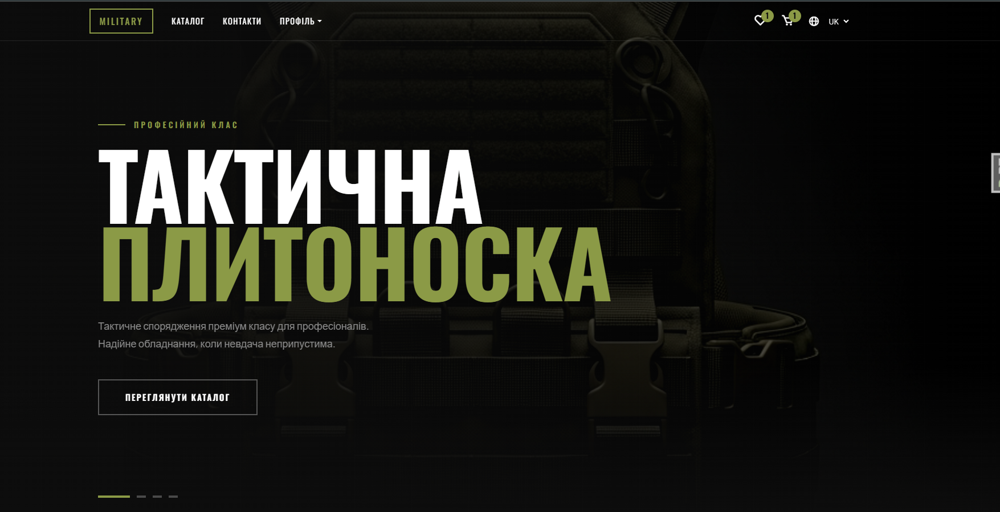
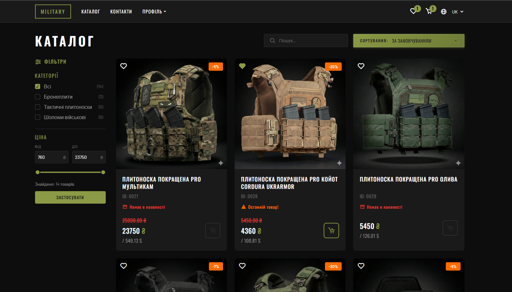
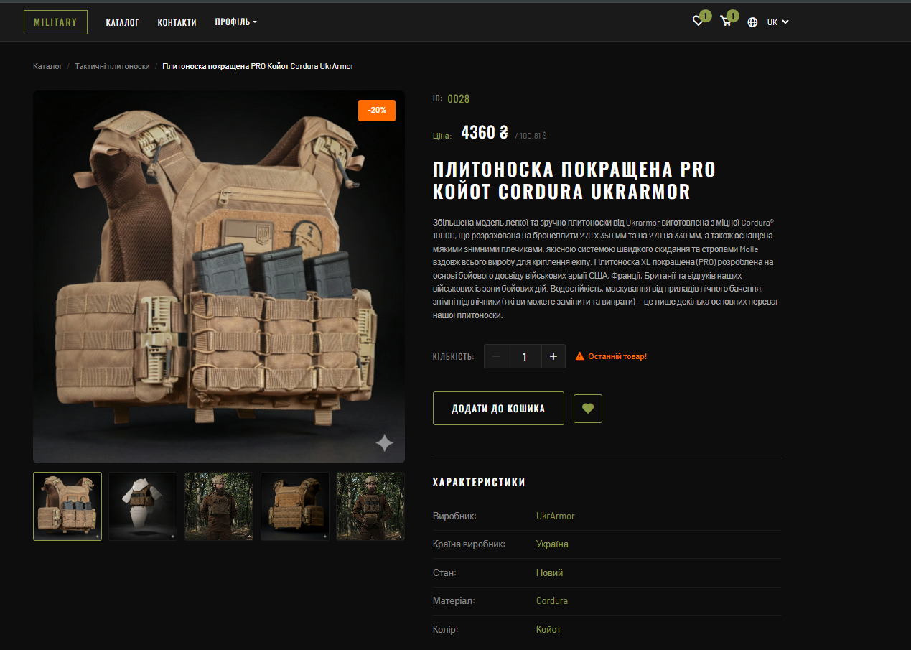
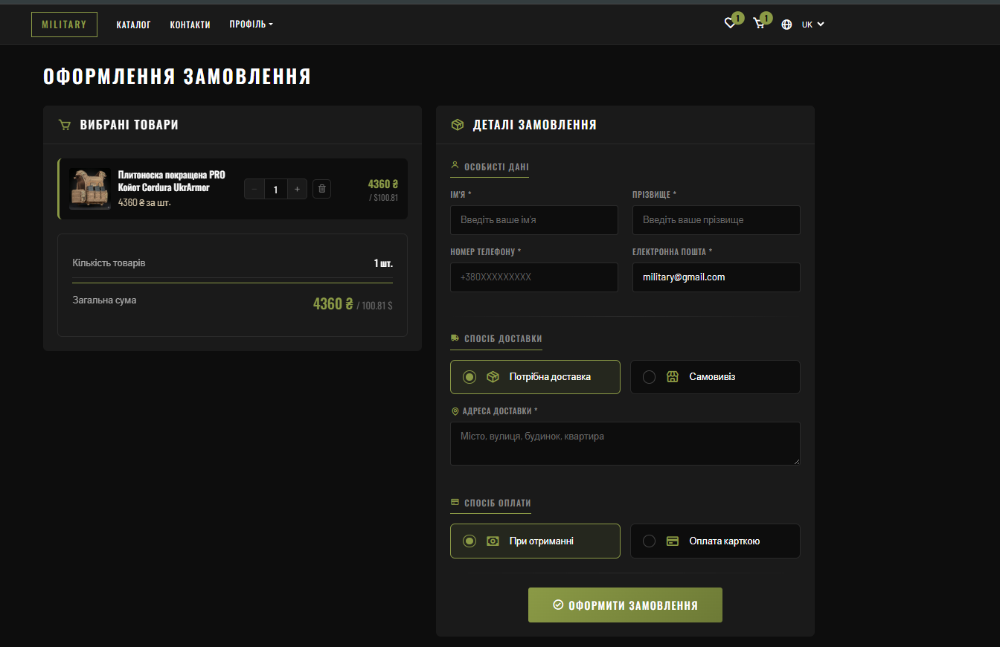
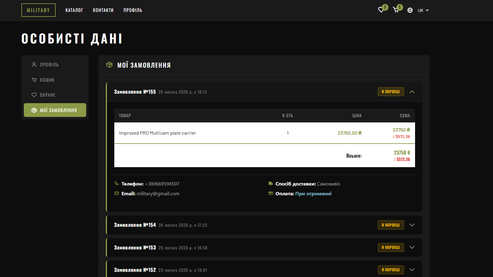
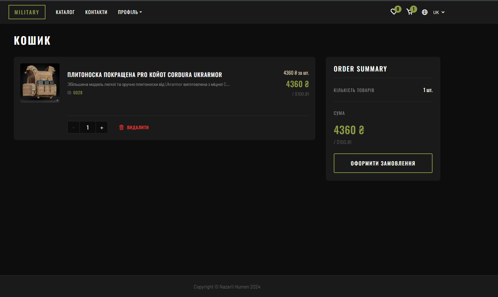
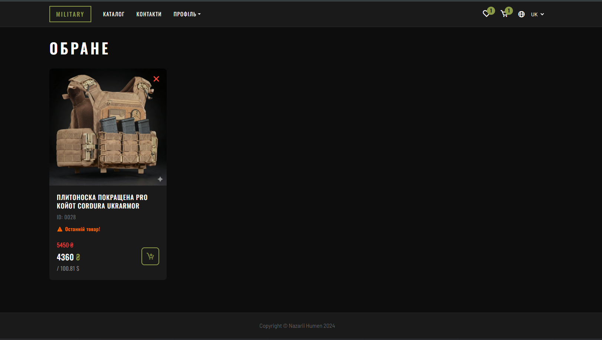
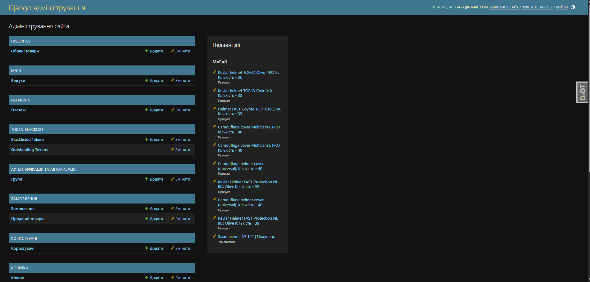

### Military Equipment Store

Diploma project — a full-featured online military equipment store built with Django REST Framework + Vue.js.

---

### Tech Stack

| Category | Technologies |
|----------|-------------|
| **Backend** | Django 5.1, Django REST Framework 3.16 |
| **Frontend** | Vue.js 3, Bootstrap, JavaScript |
| **Database** | PostgreSQL |
| **Auth** | Django Allauth (Google, GitHub OAuth), JWT (SimpleJWT) |
| **Payments** | Stripe |
| **i18n** | Django i18n, django-modeltranslation (UK/EN) |
| **API Docs** | Swagger (drf-yasg) |
| **PDF** | xhtml2pdf, ReportLab |
| **DevOps** | Docker Compose (Stripe CLI) |
| **Code Quality** | Black, isort, Flake8 |

---

### Project Structure

```
dev_env/
├── apps/
│   ├── api/            # API routing (v1)
│   ├── goods/          # Product catalog (Categories, Products, ProductImage, ProductAttribute, ExchangeRate)
│   ├── carts/          # Shopping cart (Cart)
│   ├── orders/         # Orders (Order, OrderItem)
│   ├── favorites/      # Wishlist (Favorite)
│   ├── payments/       # Stripe payments (Payment)
│   ├── users/          # Users (Custom User, Profile, Orders page)
│   └── tools/          # Middleware, adapters
├── main/               # Home page, About, Delivery, Contact, Feedback API
├── templates/          # Django templates (base.html, includes, registration)
├── static/             # CSS, JS (Vue.js apps)
├── locale/             # Translations (uk, en)
├── media/              # Uploaded files
├── dev_env/            # Django settings, urls, wsgi
├── docker-compose.yml  # Stripe CLI webhook listener
├── requirements.txt    # Python dependencies
└── manage.py
```

---

### Features

- **Product Catalog** — browsing, filtering, search, categories, product attributes
- **Shopping Cart** — add, update quantity, remove products
- **Wishlist** — save products to favorites
- **Orders** — checkout, order history, statuses (processing, shipped, delivered)
- **Online Payment** — Stripe integration (webhook via Docker)
- **Receipt Download** — PDF receipt generation for paid orders
- **Authentication** — registration, login, Google OAuth, GitHub OAuth
- **Multilingual** — Ukrainian (default) and English languages
- **Model Translation** — django-modeltranslation for product content
- **Exchange Rate** — price display in UAH and USD
- **Feedback** — contact form with API
- **Swagger** — automatic API documentation
- **Admin Panel** — Django Admin for content management

---

### Installation

#### Prerequisites
- Python 3.10+
- PostgreSQL
- Docker (for Stripe webhook)

#### Steps

```bash
# Clone the repository
git clone <repository-url>
cd dev_env

# Create virtual environment
python -m venv .venv
source .venv/bin/activate  # Linux/Mac
.venv\Scripts\activate     # Windows

# Install dependencies
pip install -r requirements.txt

# Create .env file (example below)
cp .env.example .env

# Apply migrations
python manage.py migrate

# Compile translations
django-admin compilemessages

# Create superuser
python manage.py createsuperuser

# Run server
python manage.py runserver
```

#### Environment Variables (`.env`)

```env
DEBUG=true
SECRET_KEY=your-secret-key
ALLOWED_HOSTS=["127.0.0.1","localhost"]

# Database
DB_NAME=your_db_name
DB_USER=your_db_user
DB_PASSWORD=your_db_password
DB_HOST=localhost
DB_PORT=5432

# Google OAuth
CLIENT_ID_GOOGLE=your-google-client-id
SECRET_KEY_GOOGLE=your-google-secret

# GitHub OAuth
CLIENT_ID_GITHUB=your-github-client-id
SECRET_KEY_GITHUB=your-github-secret

# Email
EMAIL_HOST_USER=your-email@gmail.com
EMAIL_HOST_PASSWORD=your-app-password

# Stripe
STRIPE_PUBLISHABLE_KEY=pk_test_...
STRIPE_SECRET_KEY=sk_test_...
STRIPE_WEBHOOK_SECRET=whsec_...
```

---

### Stripe Webhook (Docker)

```bash
docker-compose up stripe-cli
```

Stripe CLI listens for webhooks and forwards them to `localhost:8000/api/v1/payments/webhook/`.

---

### Screenshots

| Home | Catalog | Cart |
|------|---------|------|
|  |  |  |

| Orders | Profile | Basket | Favorites |
|--------|---------|--------|-----------|
|  |  |  |  |

| Admin Panel |
|-------------|
|  |

---

### API Endpoints

| Prefix | Description |
|--------|-------------|
| `/api/v1/catalog/` | Product catalog |
| `/api/v1/cart/` | Shopping cart |
| `/api/v1/orders/` | Orders |
| `/api/v1/favorites/` | Wishlist |
| `/api/v1/users/` | Users, profile |
| `/api/v1/payments/` | Payments (Stripe) |
| `/api/v1/main/feedback/` | Feedback |
| `/swagger/` | Swagger UI documentation |

---

### Author

**Nazarii Humen** © 2024
